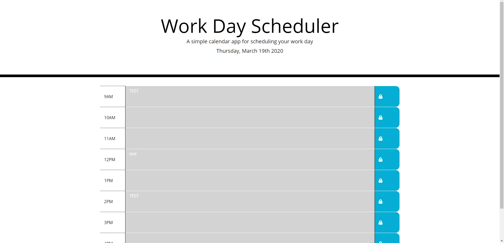

# Work Day Scheduler

This calendar will update the displayed date at the top wilth current date.  The hour blocks will dynamically change color as the time of day passes through the hours displayed. Any text entered into the hour block text areas will be saved upon pressing the blue 'save' button at the right. 

View the project [here](https://the-medium-place.github.io/work-day-scheduler/).

## HTML/CSS

The hour blocks are hard coded into the `html`, as their range and the content are static. 

Through use of the pre-coded `css` properties, the framework for the schedule came together quickly.  

## The Logic

* The time and date are captured using the `moment()` method, saving both the full date and current hour as variables `today` and `hour` respectively.

* `init()` checks for saved local storage and populates the `inputObj` with any data found there.

* A for loop runs through the current `inputObj` **values**, the `id`s of the save buttons, and th `id`s of the `textarea`s.

    * The `textarea` content on the page is updated for every `id` with a matching `key` in the `inputObj`

* An event listener covering all of the `saveBtn` class saves the corresponding `textarea` content to the click event. 

    * It then updates `inputObj` before saving the whole object to local storage using `JSON.stringinfy(inputObj)`

* A classmate helped inform me of the `$.each()` function to iterate through all of my `$textAreas`, which allowed a comparison to my `time-data` attribute and the current `hour`.
    * Using thses values the color of the `textarea` is dynamically set to the changing `hour`

